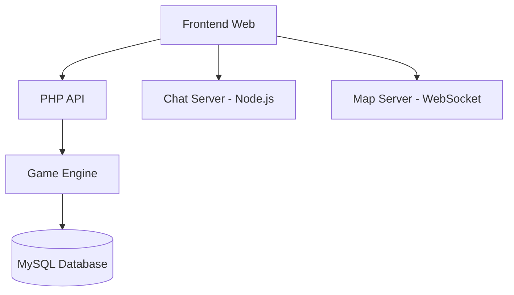

# 🏴‍☠️ Sugoi Game - One Piece MMORPG

> Um MMORPG estratégico inspirado no universo One Piece, desenvolvido por fãs para fãs

[](https://www.php.net/)
[](https://www.mysql.com/)
[](https://nodejs.org/)
[](LICENSE)

## 🌊 Sobre o Projeto

Sugoi Game é um MMORPG estratégico baseado no anime/mangá One Piece. Os jogadores podem criar suas próprias tripulações piratas ou marinhas, navegar pelos oceanos, participar de combates táticos e formar alianças épicas.

### ✨ Características Principais

- 🗺️ **Mundo Aberto**: Navegue por um oceano vasto com múltiplas ilhas
- ⚔️ **Sistema de Combate Tático**: Combates em turnos estratégicos em tabuleiro 7x7
- 👥 **Sistema de Tripulação**: Recrute e gerencie sua própria tripulação pirata
- 🏴‍☠️ **PvP Intenso**: Batalhas entre jogadores com sistema de reputação
- 🏛️ **Alianças**: Forme alianças, declare guerras e coopere com outros jogadores
- 💎 **Akuma no Mi**: Poderes únicos inspirados no universo One Piece
- 🌟 **Sistema Haki**: Três tipos de Haki para dominar
- 🏪 **Economia Completa**: Comércio, profissões e sistema monetário

## 🏗️ Arquitetura do Sistema



## 🛠️ Stack Tecnológica

### Backend
- **PHP 7.4+**: Core do servidor de jogo
- **MySQL 8.0+**: Banco de dados principal
- **WebSocket**: Servidor de mapa em tempo real

### Frontend
- **HTML5/CSS3**: Interface responsiva
- **JavaScript/jQuery**: Interatividade
- **Bootstrap**: Framework CSS

### Serviços Auxiliares
- **Node.js + Socket.io**: Servidor de chat em tempo real
- **Ratchet/ReactPHP**: WebSocket server para mapa

## 🚀 Instalação e Configuração

### Pré-requisitos
```bash
- PHP 7.4+ com extensões: mysqli, json, session
- MySQL 8.0+
- Node.js 16+
- Composer
- Web server (Apache/Nginx)
```

### 1. Clone o Repositório
```bash
git clone https://github.com/nelisjunior/sugoigame.git
cd sugoigame
```

### 2. Configuração do Banco de Dados
```bash
# Importe o schema do banco
mysql -u root -p < database/schema.sql

# Configure as credenciais em
cp public/Includes/conectdb.example.php public/Includes/conectdb.php
```

### 3. Configuração do Servidor de Chat
```bash
cd servers/chat
npm install
npm start
```

### 4. Configuração do Servidor de Mapa
```bash
cd servers/map
composer install
php server.php
```

### 5. Configuração do Web Server
```nginx
# Nginx example
server {
    listen 80;
    server_name sugoigame.local;
    root /path/to/sugoigame/public;
    index index.php;
    
    location ~ \.php$ {
        fastcgi_pass unix:/var/run/php/php7.4-fpm.sock;
        fastcgi_index index.php;
        include fastcgi_params;
        fastcgi_param SCRIPT_FILENAME $document_root$fastcgi_script_name;
    }
}
```

## 📱 Como Jogar

### Criando sua Tripulação
1. **Registre-se**: Crie uma conta no sistema
2. **Escolha sua Facção**: Pirata ou Marinha
3. **Crie sua Tripulação**: Defina nome e bandeira
4. **Recrute Personagens**: Monte sua tripulação inicial

### Sistema de Combate
- **Combates PvP**: Desafie outros jogadores
- **Combates PvE**: Enfrente NPCs e chefes
- **Estratégia**: Use o tabuleiro 7x7 para posicionamento tático
- **Habilidades**: Combine ataques, Haki e poderes Akuma no Mi

### Progressão
- **Levelar Personagens**: Ganhe XP em combates
- **Coletar Itens**: Equipamentos e consumíveis
- **Completar Missões**: Missões principais e secundárias
- **Explorar o Mundo**: Descubra novas ilhas e segredos

## 📚 Documentação

- [🏗️ Arquitetura do Sistema](docs/diagrams/01-system-architecture.md)
- [⚔️ Fluxo de Combate](docs/diagrams/02-combat-flow.md)
- [🗄️ Modelo de Dados](docs/diagrams/03-database-model.md)
- [🎯 Mapa de Funcionalidades](docs/diagrams/04-feature-map.md)
- [📡 Documentação da API](docs/api-documentation.md)

### Visualizações Interativas
- [🌌 Visão Geral do Sistema](docs/obsidian/system-overview.canvas)
- [⚔️ Galáxia de Combate](docs/obsidian/combat-galaxy.canvas)

## 🤝 Contribuindo

1. Fork o projeto
2. Crie uma branch para sua feature (`git checkout -b feature/amazing-feature`)
3. Commit suas mudanças (`git commit -m 'Add amazing feature'`)
4. Push para a branch (`git push origin feature/amazing-feature`)
5. Abra um Pull Request

### Padrões de Código
- **PHP**: PSR-12 coding standards
- **JavaScript**: ESLint configuration
- **SQL**: Snake_case para tabelas e colunas
- **Commits**: Conventional Commits

## 🐛 Relatando Bugs

Use as [Issues do GitHub](https://github.com/nelisjunior/sugoigame/issues) para relatar bugs ou solicitar features.

### Template de Bug Report
```
**Descrição do Bug**
Descrição clara do problema.

**Passos para Reproduzir**
1. Vá para '...'
2. Clique em '....'
3. Veja o erro

**Comportamento Esperado**
O que você esperava que acontecesse.

**Screenshots**
Se aplicável, adicione screenshots.

**Ambiente**
- OS: [Windows/Linux/Mac]
- Browser: [Chrome/Firefox/Safari]
- Versão: [1.0.0]
```

## 📊 Status do Projeto

- ✅ Sistema de autenticação
- ✅ Sistema de combate PvP/PvE
- ✅ Sistema de alianças
- ✅ Chat em tempo real
- ✅ Sistema de navegação
- 🚧 Sistema de eventos sazonais
- 🚧 Mobile responsiveness
- 📋 API REST completa
- 📋 Sistema de moderação

## 📈 Estatísticas

- **Linhas de Código**: ~50,000
- **Arquivos PHP**: 300+
- **Tabelas MySQL**: 50+
- **Funcionalidades**: 20+ sistemas principais

## 👥 Equipe

- **Luiz Eduardo**: Lead Developer
- **Ivan Miranda**: Core Developer
- **Comunidade**: Contributors e beta testers

## 📞 Contato

- **Website**: [sugoigame.com.br](https://sugoigame.com.br)
- **Discord**: [Servidor da Comunidade](#)
- **Email**: contato@sugoigame.com.br

## 📄 Licença

Este projeto está licenciado sob a GNU General Public License v3.0 - veja o arquivo [LICENSE](LICENSE) para detalhes.

---

<div align="center">

**Feito com ❤️ por fãs de One Piece**

[🌊 Jogar Agora](https://sugoigame.com.br) • [📚 Documentação](docs/) • [💬 Comunidade](#)

</div>