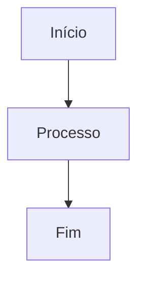

# 📚 Documentação - Sugoi Game

> Documentação completa do projeto Sugoi Game - One Piece MMORPG

## 🗂️ Índice da Documentação

### 📖 Documentação Principal
- [🏴‍☠️ README Modernizado](README-modernized.md) - Visão geral completa do projeto
- [🚀 Guia de Desenvolvimento](development-guide.md) - Guia para desenvolvedores
- [📡 Documentação da API](api-documentation.md) - Endpoints e estrutura da API

### 📊 Diagramas e Visualizações

#### Diagramas Mermaid
- [🏗️ Arquitetura do Sistema](diagrams/01-system-architecture.md) - Visão geral da arquitetura
- [⚔️ Fluxo de Combate](diagrams/02-combat-flow.md) - Sistema de combate detalhado
- [🗄️ Modelo de Dados](diagrams/03-database-model.md) - Estrutura do banco de dados
- [🎯 Mapa de Funcionalidades](diagrams/04-feature-map.md) - Funcionalidades do sistema

#### Visualizações Obsidian
- [🌌 Visão Geral do Sistema](obsidian/system-overview.canvas) - Canvas interativo
- [⚔️ Galáxia de Combate](obsidian/combat-galaxy.canvas) - Visualização do sistema de combate

## 🎯 Como Navegar na Documentação

### Para Novos Desenvolvedores
1. 📖 Comece com o [README Modernizado](README-modernized.md)
2. 🚀 Siga o [Guia de Desenvolvimento](development-guide.md)
3. 🏗️ Entenda a [Arquitetura do Sistema](diagrams/01-system-architecture.md)

### Para Entender o Sistema de Combate
1. ⚔️ Leia o [Fluxo de Combate](diagrams/02-combat-flow.md)
2. 🌌 Explore a [Galáxia de Combate](obsidian/combat-galaxy.canvas)
3. 📡 Consulte a [API de Combate](api-documentation.md#sistema-de-combate)

### Para Trabalhar com Dados
1. 🗄️ Estude o [Modelo de Dados](diagrams/03-database-model.md)
2. 📡 Consulte a [Documentação da API](api-documentation.md)
3. 🚀 Veja as práticas no [Guia de Desenvolvimento](development-guide.md#padrões-de-código)

## 🔍 Visão Geral do Projeto

### Tecnologias Principais
- **Backend**: PHP 7.4+, MySQL 8.0+
- **Frontend**: HTML5, CSS3, JavaScript, Bootstrap
- **Tempo Real**: Node.js + Socket.io (Chat), WebSocket (Mapa)
- **Arquitetura**: MVC com separação clara de responsabilidades

### Sistemas Principais
- 🔐 **Autenticação**: Login tradicional e Facebook
- ⚔️ **Combate**: Sistema tático turn-based em tabuleiro 7x7
- 🏴‍☠️ **Tripulação**: Gerenciamento de personagens e habilidades
- 🌊 **Navegação**: Mundo aberto com oceanos e ilhas
- 🏛️ **Alianças**: Sistema de guilds com guerras e cooperação
- 💰 **Economia**: Moedas, itens, comércio e pagamentos

### Métricas do Projeto
- **~50.000** linhas de código
- **300+** arquivos PHP
- **50+** tabelas MySQL
- **20+** sistemas principais
- **Suporte** para centenas de jogadores simultâneos

## 🛠️ Ferramentas de Visualização

### Para Ver os Diagramas Mermaid
- **GitHub**: Renderização automática nos arquivos .md
- **VS Code**: Extensão "Mermaid Preview"
- **Online**: [mermaid.live](https://mermaid.live/)

### Para Ver os Canvas Obsidian
- **Obsidian**: Abra os arquivos .canvas no Obsidian
- **Visualizador Online**: Pode ser visualizado como JSON
- **VS Code**: Com extensão apropriada para JSON

## 📝 Contribuindo com a Documentação

### Adicionando Nova Documentação
```bash
# 1. Crie um arquivo na pasta apropriada
docs/
├── new-feature.md          # Para documentação geral
├── diagrams/new-diagram.md # Para diagramas
└── obsidian/new-view.canvas # Para visualizações

# 2. Adicione link neste índice
# 3. Commit e push das mudanças
```

### Padrões para Documentação
- **Markdown**: Usar sintaxe padrão com emojis para melhor legibilidade
- **Diagramas**: Usar Mermaid para consistência
- **Imagens**: Colocar na pasta `docs/images/` quando necessário
- **Links**: Usar links relativos sempre que possível

### Atualizando Diagramas
```markdown
# Exemplo de diagrama Mermaid


## 🔄 Versionamento da Documentação

A documentação segue o versionamento do projeto principal:
- **Major**: Mudanças significativas na arquitetura
- **Minor**: Novas funcionalidades documentadas
- **Patch**: Correções e melhorias na documentação

## 📞 Suporte

Para dúvidas sobre a documentação:
- 🐛 **Issues**: Use as issues do GitHub para reportar problemas
- 💬 **Discussões**: Use as discussions para perguntas
- 📧 **Email**: contato@sugoigame.com.br

---

<div align="center">

**Documentação mantida pela equipe de desenvolvimento**

[🏠 Voltar ao README Principal](../README.md) • [🌐 Site Oficial](https://sugoigame.com.br)

</div>