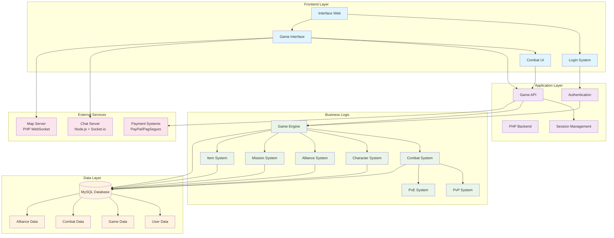

# Arquitetura do Sistema - Sugoi Game

## Componentes Principais

### Frontend Layer
- **Interface Web**: Interface principal do jogo em HTML/CSS/JavaScript
- **Login System**: Sistema de autenticação com suporte a Facebook
- **Game Interface**: Interface principal do jogo
- **Combat UI**: Interface específica para combates

### Application Layer
- **PHP Backend**: Servidor principal em PHP
- **Game API**: APIs REST para comunicação frontend-backend
- **Authentication**: Sistema de autenticação e autorização
- **Session Management**: Gerenciamento de sessões de usuário

### Business Logic
- **Game Engine**: Motor principal do jogo
- **Combat System**: Sistema de combate turn-based
- **Character System**: Gerenciamento de personagens e tripulação
- **Alliance System**: Sistema de alianças entre jogadores
- **Mission System**: Sistema de missões e quests
- **Item System**: Gerenciamento de itens e equipamentos
- **PvP System**: Sistema Player vs Player
- **PvE System**: Sistema Player vs Environment

### Data Layer
- **MySQL Database**: Banco de dados principal
- **User Data**: Dados de usuários e contas
- **Game Data**: Dados de jogo (personagens, itens, etc.)
- **Combat Data**: Dados de combates e logs
- **Alliance Data**: Dados de alianças e guilds

### External Services
- **Chat Server**: Servidor de chat em Node.js com Socket.io
- **Map Server**: Servidor de mapa em PHP WebSocket
- **Payment Systems**: Integração com PayPal e PagSeguro