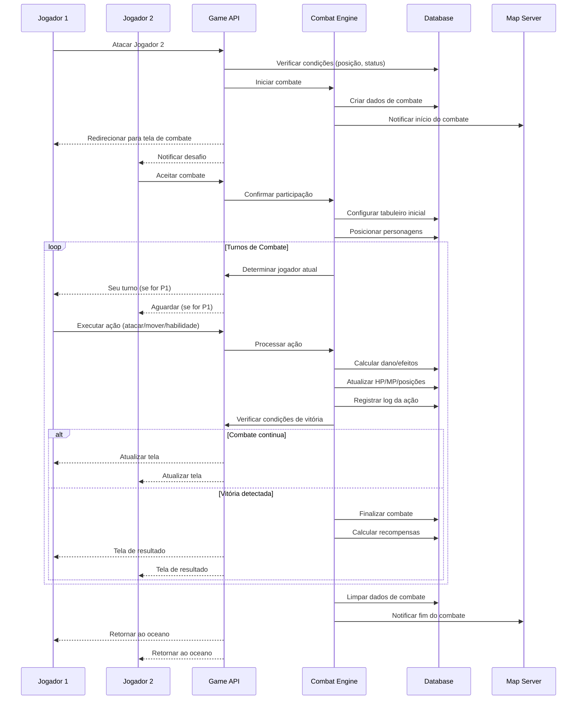
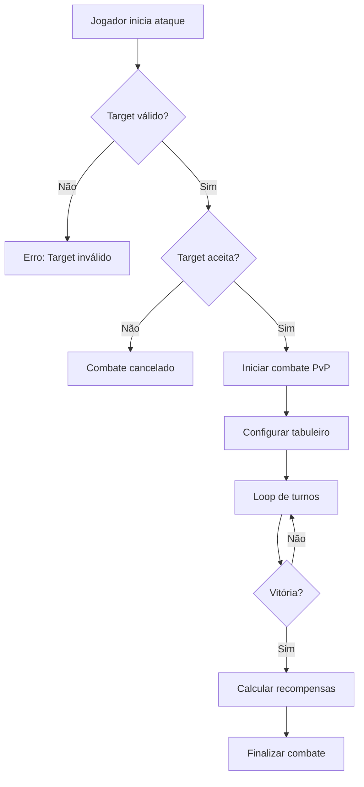
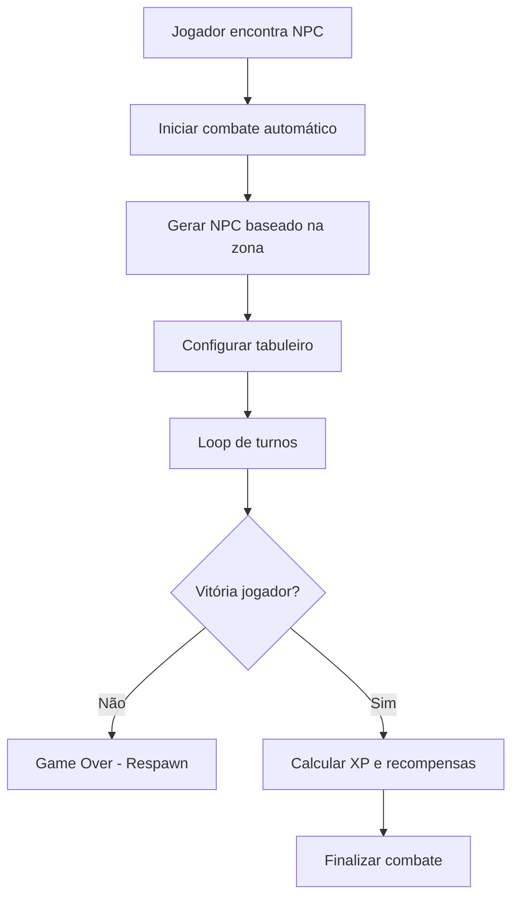
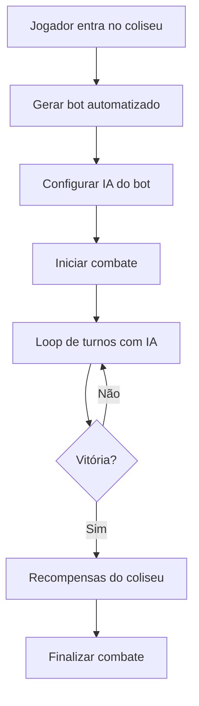
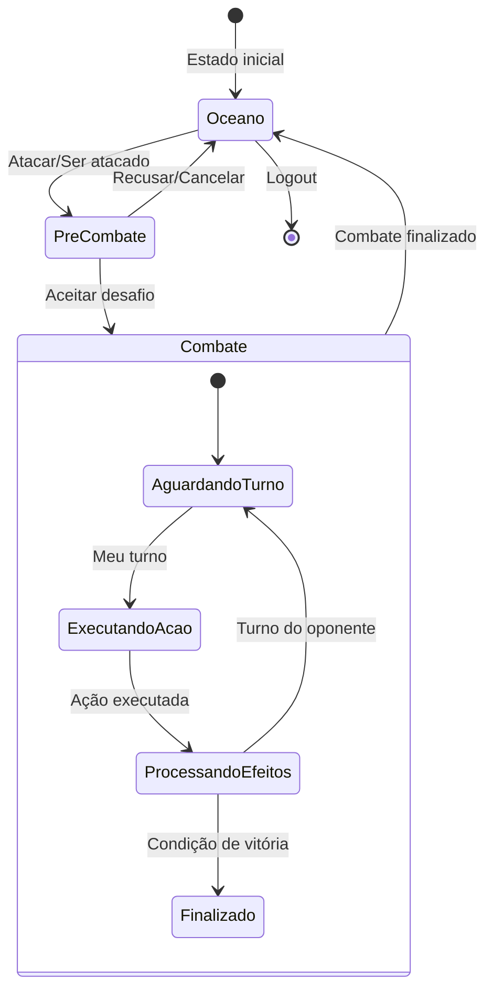

# Fluxo de Combate - Sugoi Game

```mermaid
sequenceDiagram
    participant Player1 as Jogador 1
    participant Player2 as Jogador 2
    participant API as Game API
    participant CombatEngine as Combat Engine
    participant DB as Database
    participant MapServer as Map Server

    %% Início do Combate
    Player1->>API: Atacar Jogador 2
    API->>DB: Verificar condições (posição, status)
    API->>CombatEngine: Iniciar combate
    CombatEngine->>DB: Criar dados de combate
    CombatEngine->>MapServer: Notificar início do combate
    API-->>Player1: Redirecionar para tela de combate
    API-->>Player2: Notificar desafio

    %% Preparação do Combate
    Player2->>API: Aceitar combate
    API->>CombatEngine: Confirmar participação
    CombatEngine->>DB: Configurar tabuleiro inicial
    CombatEngine->>DB: Posicionar personagens
    
    %% Loop de Combate
    loop Turnos de Combate
        CombatEngine->>API: Determinar jogador atual
        API-->>Player1: Seu turno (se for P1)
        API-->>Player2: Aguardar (se for P1)
        
        Player1->>API: Executar ação (atacar/mover/habilidade)
        API->>CombatEngine: Processar ação
        CombatEngine->>DB: Calcular dano/efeitos
        CombatEngine->>DB: Atualizar HP/MP/posições
        CombatEngine->>DB: Registrar log da ação
        
        CombatEngine->>API: Verificar condições de vitória
        alt Combate continua
            API-->>Player1: Atualizar tela
            API-->>Player2: Atualizar tela
        else Vitória detectada
            CombatEngine->>DB: Finalizar combate
            CombatEngine->>DB: Calcular recompensas
            API-->>Player1: Tela de resultado
            API-->>Player2: Tela de resultado
        end
    end

    %% Finalização
    CombatEngine->>DB: Limpar dados de combate
    CombatEngine->>MapServer: Notificar fim do combate
    API-->>Player1: Retornar ao oceano
    API-->>Player2: Retornar ao oceano
```

## Tipos de Combate

### PvP (Player vs Player)

```mermaid
flowchart TD
    A[Jogador inicia ataque] --> B{Target válido?}
    B -->|Não| C[Erro: Target inválido]
    B -->|Sim| D{Target aceita?}
    D -->|Não| E[Combate cancelado]
    D -->|Sim| F[Iniciar combate PvP]
    F --> G[Configurar tabuleiro]
    G --> H[Loop de turnos]
    H --> I{Vitória?}
    I -->|Não| H
    I -->|Sim| J[Calcular recompensas]
    J --> K[Finalizar combate]
```

### PvE (Player vs Environment)

```mermaid
flowchart TD
    A[Jogador encontra NPC] --> B[Iniciar combate automático]
    B --> C[Gerar NPC baseado na zona]
    C --> D[Configurar tabuleiro]
    D --> E[Loop de turnos]
    E --> F{Vitória jogador?}
    F -->|Não| G[Game Over - Respawn]
    F -->|Sim| H[Calcular XP e recompensas]
    H --> I[Finalizar combate]
```

### Bot Combat (Coliseu)

```mermaid
flowchart TD
    A[Jogador entra no coliseu] --> B[Gerar bot automatizado]
    B --> C[Configurar IA do bot]
    C --> D[Iniciar combate]
    D --> E[Loop de turnos com IA]
    E --> F{Vitória?}
    F -->|Não| E
    F -->|Sim| G[Recompensas do coliseu]
    G --> H[Finalizar combate]
```

## Estados do Sistema de Combate

```mermaid
stateDiagram-v2
    [*] --> Oceano: Estado inicial
    Oceano --> PreCombate: Atacar/Ser atacado
    PreCombate --> Combate: Aceitar desafio
    PreCombate --> Oceano: Recusar/Cancelar
    
    state Combate {
        [*] --> AguardandoTurno
        AguardandoTurno --> ExecutandoAcao: Meu turno
        ExecutandoAcao --> ProcessandoEfeitos: Ação executada
        ProcessandoEfeitos --> AguardandoTurno: Turno do oponente
        ProcessandoEfeitos --> Finalizado: Condição de vitória
    }
    
    Combate --> Oceano: Combate finalizado
    Oceano --> [*]: Logout
```