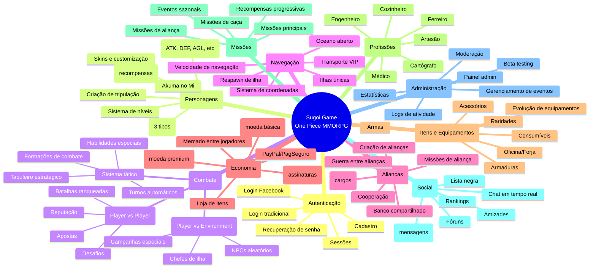

# Mapa de Funcionalidades - Sugoi Game

## Módulos Principais

### Core Systems
- **Authentication System**: Login, registro, sessões
- **Character Management**: Criação, evolução, customização
- **Combat Engine**: PvP, PvE, sistema tático
- **Navigation System**: Movimento pelo oceano

### Game Features
- **Alliance System**: Guilds, guerras, cooperação
- **Economy System**: Moedas, loja, pagamentos
- **Item System**: Equipamentos, consumíveis, evolução
- **Profession System**: Classes especializadas

### Content Systems
- **Quest System**: Missões, eventos, campanhas
- **Social Features**: Chat, mensagens, rankings
- **Admin Tools**: Moderação, estatísticas, eventos

### Technical Infrastructure
- **Database Layer**: MySQL com múltiplas tabelas
- **Real-time Communication**: Socket.io para chat
- **WebSocket Server**: Para atualizações de mapa
- **Payment Integration**: PayPal, PagSeguro